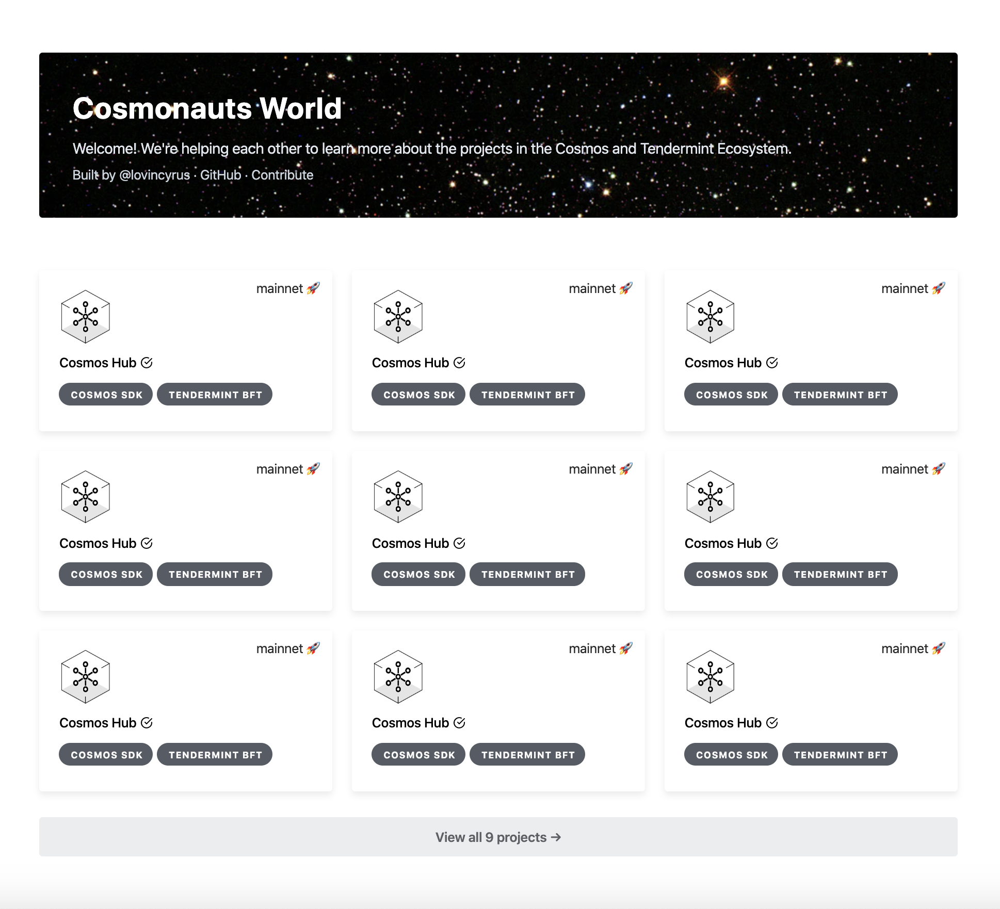

# cosmonauts-world

Projects in the Cosmos and Tendermint Ecosystem 🌌

Built with `Next.js` + `Tailwind CSS` + `Framer Motion API` + `Feather icons`

Live site: https://cosmonauts.world

📣: This is an experimental project by [@lovincyrus](https://github.com/lovincyrus), and it is not a Cosmos organization project.

## Motivation

This project aims to answer questions as such,

1. How many projects are in the Cosmos and Tendermint Ecosystem?
2. Which projects are using which technology?

This repository will be the singular source of truth for the Cosmos & Tendermint projects. Therefore, this repository should be considered as a living document which will be maintained by the community. This repository is not limited to the ecosystem listed on [Cosmos Network - Ecosystem](https://cosmos.network/ecosystem). So long as you're using Cosmos / Tendermint, you can add your project to the `JSON` [file](/data/posts-manifest.js). 🌌

## Run this locally

1. `$ git clone https://github.com/lovincyrus/cosmonauts-world.git`
2. `$ cd cosmonauts-world`
3. `$ npm i`
4. `$ npm run dev`
5. View the running app in your browser at `http://localhost:3000`

## Contribution

To submit a feature, bug fix, typo, or enhancement to the site, you may add an issue or (even better) create a pull request to [this repository](https://github.com/lovincyrus/cosmonauts-world).

**Note:** Please abide by the [Code of Conduct](CODE_OF_CONDUCT.md) in all interactions.

### Adding a project

1. Review this [posts-manifest.js](/data/posts-manifest.js)
2. Follow this format [posts-manifest.default.js](/data/posts-manifest.default.js)
3. Name `your-project-logo.png` in kebab-case
4. Copy your project logo with _transparent background_ (.png / .jpg) into `/static/logos/`
5. Ensure that verified status must be `false` by default
6. _MUST_ provide proof! (either in blog post, whitepaper, public announcement, codebase, etc)
7. Insert social links (optional)
8. Add relevant tags (cosmos sdk, tendermint core, tendermint bft, ethermint, etc)
9. Finally, update `posts-manifest.js`, double check, and create a pull request 🚀

### Suggesting a project

Please use Project template when creating an issue. 🤝

## Related resources

- [Ecosystem - Cosmos Network](https://cosmos.network/ecosystem)
- [List of projects in Cosmos & Tendermint Ecosystem](https://forum.cosmos.network/t/list-of-projects-in-cosmos-tendermint-ecosystem/243)
- [cosmos/awesome](https://github.com/cosmos/awesome)
- [tendermint/awesome](https://github.com/tendermint/awesome)

## Feedback

Please open issues at any time for general feedback, or you can reach me directly at cyrus@tendermint.com. We really appreciate any contribution.

## Credits

Bright Center Star Cluster by [NASA](https://unsplash.com/photos/OVO8nK-7Rfs)
